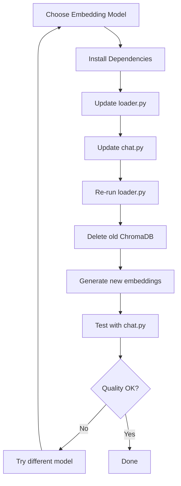

# Local Embedding Models - Options & Migration Plan

## Current State Analysis

Your RAG system currently uses [`OpenAIEmbeddings`](src/loader.py:61) in two places:
1. **[`loader.py`](src/loader.py:61)** - Creates embeddings when loading PDF chunks into ChromaDB
2. **[`chat.py`](src/chat.py:16)** - Loads the same embedding function to query the vectorstore

**Important:** Both files must use the **same embedding model** because:
- Embeddings create vector representations in a specific dimensional space
- Different models create incompatible vector spaces
- If you change the embedding model, you must re-index your data

---

## Local Embedding Options

### Option 1: Ollama Embeddings ⭐ **RECOMMENDED**

**Best for:** Easy setup, good performance, actively maintained

**Pros:**
- Simple installation and management via Ollama CLI
- Runs completely local (no API calls, no costs)
- Multiple embedding models available
- Consistent with using Ollama for LLMs
- Good integration with LangChain

**Cons:**
- Requires Ollama to be running
- Limited model selection compared to HuggingFace
- Requires downloading models first

**Available Models:**
- `nomic-embed-text` (137M params, 768 dims) - General purpose, RECOMMENDED
- `mxbai-embed-large` (335M params, 1024 dims) - Higher quality, slower
- `all-minilm` (23M params, 384 dims) - Faster, smaller

**Setup:**
```bash
# Install Ollama (if not already installed)
# Visit: https://ollama.aiplans/local-embeddings-options.md

# Pull an embedding model
ollama pull nomic-embed-text
```

**Dependencies to add:**
```toml
langchain-ollama>=0.2.0
```

**Code changes:**
```python
# In both loader.py and chat.py
from langchain_ollama import OllamaEmbeddings

embeddings = OllamaEmbeddings(
    model="nomic-embed-text",
    base_url="http://localhost:11434"  # default Ollama URL
)
```

---

### Option 2: HuggingFace Embeddings

**Best for:** Maximum model choice, customization

**Pros:**
- Thousands of pre-trained models available
- No external service needed (runs locally)
- Can choose models optimized for specific domains
- Great for experimentation

**Cons:**
- First run downloads models (can be large, 100MB-2GB)
- Slower than Ollama on first load
- Requires more dependencies

**Popular Models:**
- `sentence-transformers/all-MiniLM-L6-v2` (23M params, 384 dims) - Fast, good baseline
- `sentence-transformers/all-mpnet-base-v2` (110M params, 768 dims) - Better quality
- `BAAI/bge-small-en-v1.5` (33M params, 384 dims) - Good for English
- `BAAI/bge-base-en-v1.5` (109M params, 768 dims) - Better quality

**Dependencies to add:**
```toml
langchain-huggingface>=0.1.0
sentence-transformers>=3.3.0
```

**Code changes:**
```python
# In both loader.py and chat.py
from langchain_huggingface import HuggingFaceEmbeddings

embeddings = HuggingFaceEmbeddings(
    model_name="sentence-transformers/all-MiniLM-L6-v2",
    model_kwargs={'device': 'cpu'},  # or 'cuda' if you have GPU
    encode_kwargs={'normalize_embeddings': True}
)
```

---

### Option 3: GPT4All Embeddings

**Best for:** Privacy-focused, offline-first setups

**Pros:**
- Completely offline
- Privacy-focused
- Easy to use
- No external dependencies

**Cons:**
- Limited model selection
- Less actively developed than Ollama
- Slower than other options

**Dependencies to add:**
```toml
langchain-community>=0.4.1  # already in your project
gpt4all>=2.8.0
```

**Code changes:**
```python
# In both loader.py and chat.py
from langchain_community.embeddings import GPT4AllEmbeddings

embeddings = GPT4AllEmbeddings(
    model_name="all-MiniLM-L6-v2.gguf2.f16.gguf"
)
```

---

### Option 4: SentenceTransformers (Direct)

**Best for:** Fine-grained control, custom models

**Pros:**
- Direct access to sentence-transformers library
- More control over model configuration
- Can use custom fine-tuned models
- Widest model compatibility

**Cons:**
- Requires manual integration with LangChain
- More code to write

**Dependencies to add:**
```toml
sentence-transformers>=3.3.0
```

**Code changes:**
```python
# In both loader.py and chat.py
from langchain_community.embeddings import HuggingFaceEmbeddings

embeddings = HuggingFaceEmbeddings(
    model_name="all-MiniLM-L6-v2",
    model_kwargs={'device': 'cpu'}
)
```

---

## Comparison Matrix

| Feature | Ollama | HuggingFace | GPT4All | SentenceTransformers |
|---------|--------|-------------|---------|---------------------|
| **Ease of Setup** | ⭐⭐⭐⭐⭐ | ⭐⭐⭐⭐ | ⭐⭐⭐ | ⭐⭐⭐ |
| **Model Selection** | ⭐⭐⭐ | ⭐⭐⭐⭐⭐ | ⭐⭐ | ⭐⭐⭐⭐⭐ |
| **Performance** | ⭐⭐⭐⭐⭐ | ⭐⭐⭐⭐ | ⭐⭐⭐ | ⭐⭐⭐⭐ |
| **LangChain Integration** | ⭐⭐⭐⭐⭐ | ⭐⭐⭐⭐⭐ | ⭐⭐⭐⭐ | ⭐⭐⭐⭐ |
| **Documentation** | ⭐⭐⭐⭐⭐ | ⭐⭐⭐⭐ | ⭐⭐⭐ | ⭐⭐⭐⭐ |
| **Privacy** | ⭐⭐⭐⭐⭐ | ⭐⭐⭐⭐⭐ | ⭐⭐⭐⭐⭐ | ⭐⭐⭐⭐⭐ |
| **No API Costs** | ⭐⭐⭐⭐⭐ | ⭐⭐⭐⭐⭐ | ⭐⭐⭐⭐⭐ | ⭐⭐⭐⭐⭐ |

---

## Migration Strategy

### High-Level Migration Flow



### Step-by-Step Migration Plan

#### Phase 1: Preparation
1. **Backup current ChromaDB** (optional but recommended)
   ```bash
   cp -r ./chroma_db ./chroma_db.backup
   ```

2. **Choose your embedding model** (see recommendations below)

3. **Install required dependencies**
   ```bash
   # For Ollama
   uv add langchain-ollama

   # OR for HuggingFace
   uv add langchain-huggingface sentence-transformers

   # OR for GPT4All
   uv add gpt4all
   ```

#### Phase 2: Code Updates
4. **Update [`loader.py`](src/loader.py:61)**
   - Replace line 4: `from langchain_openai import OpenAIEmbeddings`
   - Replace line 61: `embeddings = OpenAIEmbeddings()`
   - Add new import and configuration for chosen model

5. **Update [`chat.py`](src/chat.py:16)**
   - Replace line 7: `from langchain_openai import OpenAIEmbeddings`
   - Update `load_vectorstore()` function (line 16)
   - Ensure exact same embedding configuration as loader.py

#### Phase 3: Re-indexing
6. **Delete existing ChromaDB collection**
   - The code already handles this in loader.py (lines 51-57)
   - Or manually delete: `rm -rf ./chroma_db`

7. **Run the loader with new embeddings**
   ```bash
   # In loader.py, uncomment line 86
   uv run python src/loader.py
   ```

8. **Verify embeddings were created**
   - Check ChromaDB directory size
   - Verify similarity search results

#### Phase 4: Testing
9. **Test the chat interface**
   ```bash
   uv run python src/chat.py
   ```

10. **Compare retrieval quality**
    - Use the same test questions
    - Compare relevance of retrieved chunks
    - Adjust `k` parameter if needed (currently 4 in chat.py)

---

## Recommendations by Use Case

### For Quick Start & General Use
**Use Ollama with nomic-embed-text**
- Best balance of ease and quality
- Works well with your existing Ollama setup (if used for LLM)
- 768 dimensions provides good semantic understanding

### For Maximum Quality
**Use HuggingFace with all-mpnet-base-v2**
- Better semantic understanding
- Good for complex documents
- More accurate retrieval

### For Speed & Resource Efficiency
**Use HuggingFace with all-MiniLM-L6-v2**
- Smaller model, faster processing
- 384 dimensions still provides decent quality
- Lower memory footprint

### For Privacy-Critical Projects
**Use GPT4All**
- Guaranteed offline operation
- No telemetry
- Good for sensitive documents

---

## Testing Strategy

### Performance Metrics to Track

1. **Indexing Time**
   - Time to process 126 pages
   - Monitor in loader.py output

2. **Memory Usage**
   - Peak RAM during embedding generation
   - ChromaDB storage size

3. **Retrieval Quality**
   - Ask the same 5-10 test questions
   - Compare retrieved chunk relevance
   - Check if answers change significantly

4. **Query Speed**
   - Time from question to first retrieved chunk
   - Overall response time in chat interface

### Test Questions (Examples)
```python
test_questions = [
    "What is the first step?",  # Already in loader.py
    "What are the main conclusions?",
    "Summarize chapter 3",
    "What methodology was used?",
    "What are the key findings on page 50?"
]
```

### Quality Assessment Checklist
- [ ] Retrieved chunks are semantically relevant
- [ ] Correct page numbers are returned
- [ ] Answers are coherent and accurate
- [ ] No significant quality degradation vs OpenAI
- [ ] Performance is acceptable for your use case

---

## Configuration Best Practices

### Making Embeddings Configurable

Consider creating a configuration module for easy switching:

```python
# src/config.py
from enum import Enum
from langchain_core.embeddings import Embeddings

class EmbeddingProvider(Enum):
    OPENAI = "openai"
    OLLAMA = "ollama"
    HUGGINGFACE = "huggingface"
    GPT4ALL = "gpt4all"

def get_embeddings(provider: EmbeddingProvider = EmbeddingProvider.OLLAMA) -> Embeddings:
    if provider == EmbeddingProvider.OLLAMA:
        from langchain_ollama import OllamaEmbeddings
        return OllamaEmbeddings(model="nomic-embed-text")

    elif provider == EmbeddingProvider.HUGGINGFACE:
        from langchain_huggingface import HuggingFaceEmbeddings
        return HuggingFaceEmbeddings(
            model_name="sentence-transformers/all-MiniLM-L6-v2"
        )

    elif provider == EmbeddingProvider.OPENAI:
        from langchain_openai import OpenAIEmbeddings
        return OpenAIEmbeddings()

    elif provider == EmbeddingProvider.GPT4ALL:
        from langchain_community.embeddings import GPT4AllEmbeddings
        return GPT4AllEmbeddings()

    else:
        raise ValueError(f"Unknown provider: {provider}")
```

Then in both loader.py and chat.py:
```python
from config import get_embeddings, EmbeddingProvider

embeddings = get_embeddings(EmbeddingProvider.OLLAMA)
```

---

## Next Steps

1. **Review this plan** and decide which embedding option best fits your needs
2. **Choose a model** from the recommendations
3. **Switch to Code mode** to implement the changes
4. **Test thoroughly** with your PDF document
5. **Compare quality** with OpenAI embeddings (if you have existing results)

Would you like me to proceed with implementing one of these options?
