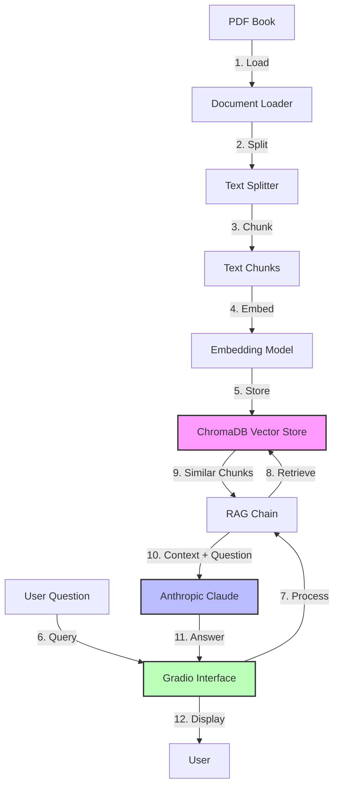

# PDF Question-Answering Chatbot Architecture

## Project Overview
A chatbot that can answer questions from a PDF book using Python, LangChain, Anthropic Claude, ChromaDB, and Gradio.

## Technology Stack

### Core Components
- **Language**: Python 3.9+
- **LLM Framework**: LangChain
- **LLM Provider**: Anthropic (Claude 3.5 Sonnet or Claude 3 Opus)
- **Vector Database**: ChromaDB (local, persistent)
- **Embedding Model**: Anthropic embeddings or OpenAI embeddings
- **UI Framework**: Gradio (with ChatInterface component)
- **PDF Processing**: PyPDF2 or pypdf

### Key Dependencies
```
langchain
langchain-anthropic
langchain-community
chromadb
gradio
pypdf
python-dotenv
```

## Architecture Overview

The system follows a RAG (Retrieval-Augmented Generation) pattern with the following flow:



## Detailed Component Breakdown

### 1. Document Ingestion Pipeline

#### PDF Loading
- **PyPDF** or **PyPDF2** for extracting text from PDF
- Handles multi-page documents
- Preserves structure and metadata

#### Text Splitting
- **RecursiveCharacterTextSplitter** - Best for general text
  - Splits on paragraphs, then sentences, then characters
  - Configurable chunk size and overlap
  - Recommended: chunk_size=1000, chunk_overlap=200

#### Alternative Splitters
- **CharacterTextSplitter** - Simple character-based splitting
- **TokenTextSplitter** - Splits based on token count
- **SemanticChunker** - Splits based on semantic meaning (newer, experimental)

### 2. Vector Storage & Retrieval

#### ChromaDB Configuration
- **Local persistent storage** - Data saved to disk
- **In-memory option** - For testing/development
- **Collections** - Organize different documents
- **Metadata filtering** - Filter by source, page number, etc.

#### Embedding Options
1. **Anthropic Embeddings** (Recommended)
   - Native integration with Claude
   - Consistent with LLM provider
   - voyageai embeddings via Anthropic

2. **OpenAI Embeddings**
   - text-embedding-3-small (cheap, fast)
   - text-embedding-3-large (better quality)

3. **Open-source Embeddings**
   - sentence-transformers/all-MiniLM-L6-v2 (local, free)
   - Slower but no API costs

### 3. Retrieval Strategy

#### Basic Retrieval
- **Similarity Search** - Find k most similar chunks
- Default k=4 to 6 chunks

#### Advanced Retrieval Options
1. **MMR (Maximal Marginal Relevance)**
   - Balances relevance with diversity
   - Reduces redundant results

2. **Similarity Score Threshold**
   - Only return chunks above certain similarity score
   - Filters out irrelevant results

3. **Contextual Compression**
   - Uses LLM to compress/filter retrieved chunks
   - Extracts only relevant parts

4. **Parent Document Retrieval**
   - Store small chunks for retrieval
   - Return larger parent documents for context

5. **Multi-Query Retrieval**
   - Generate multiple variations of user query
   - Retrieve for each variation
   - Combine results

### 4. LLM Integration (Anthropic Claude)

#### Model Options
1. **Claude 3.5 Sonnet** (Recommended)
   - Best balance of speed, cost, and quality
   - 200K context window
   - Great for reasoning

2. **Claude 3 Opus**
   - Highest quality
   - More expensive
   - Best for complex questions

3. **Claude 3 Haiku**
   - Fastest and cheapest
   - Good for simple Q&A

#### Prompt Engineering
- System prompt defines chatbot behavior
- Include instructions for:
  - Answering based on context only
  - Admitting when information not found
  - Citing source pages
  - Tone and style

### 5. RAG Chain Architecture

#### Option A: RetrievalQA Chain (Simple)
```python
chain = RetrievalQA.from_chain_type(
    llm=anthropic_llm,
    retriever=vectorstore.as_retriever(),
    chain_type="stuff"  # or "map_reduce", "refine"
)
```

**Chain Types:**
- **stuff** - Put all context in one prompt (fastest, works for small contexts)
- **map_reduce** - Process each chunk separately, then combine (better for many chunks)
- **refine** - Iteratively refine answer with each chunk (most thorough)

#### Option B: ConversationalRetrievalChain (With Memory)
```python
chain = ConversationalRetrievalChain.from_llm(
    llm=anthropic_llm,
    retriever=vectorstore.as_retriever(),
    memory=ConversationBufferMemory()
)
```

**Benefits:**
- Maintains conversation history
- Handles follow-up questions
- Context-aware responses

#### Option C: Custom LCEL Chain (Most Flexible)
- Use LangChain Expression Language (LCEL)
- Full control over each step
- Easy to debug and modify
- Can add custom logic

### 6. Gradio Interface

#### ChatInterface Component
```python
import gradio as gr

demo = gr.ChatInterface(
    fn=chat_function,
    title="PDF Question Answering Bot",
    description="Ask questions about your PDF book",
    examples=["What is the main topic?", "Summarize chapter 1"]
)
```

**Features:**
- Built-in chat history
- Message streaming support
- File upload capability
- Customizable theme

## Project Structure

```
langchain-1212-rag/
├── .env                    # API keys and configuration
├── requirements.txt        # Python dependencies
├── README.md              # Project documentation
├── plans/                 # Architecture and planning docs
│   └── pdf-chatbot-architecture.md
├── data/                  # PDF storage
│   └── books/
│       └── your_book.pdf
├── vector_store/          # ChromaDB persistent storage
├── src/
│   ├── __init__.py
│   ├── config.py          # Configuration management
│   ├── document_loader.py # PDF loading and splitting
│   ├── vector_store.py    # ChromaDB setup and operations
│   ├── retrieval.py       # Retrieval strategies
│   ├── chains.py          # LangChain RAG chains
│   ├── prompts.py         # Prompt templates
│   └── utils.py           # Helper functions
├── app.py                 # Main Gradio application
└── scripts/
    └── ingest_pdf.py      # One-time PDF ingestion script
```

## Implementation Workflow

### Phase 1: Environment Setup
1. Create virtual environment
2. Install dependencies
3. Set up environment variables (ANTHROPIC_API_KEY)
4. Create project structure

### Phase 2: Document Processing
1. Implement PDF loader
2. Configure text splitter
3. Test chunking on sample PDF
4. Verify chunk quality and size

### Phase 3: Vector Store Setup
1. Initialize ChromaDB
2. Configure embedding model
3. Ingest PDF chunks
4. Test similarity search

### Phase 4: RAG Chain Implementation
1. Set up Anthropic LLM
2. Create retrieval chain
3. Design prompts
4. Test Q&A functionality

### Phase 5: Gradio Interface
1. Create ChatInterface
2. Integrate RAG chain
3. Add conversation memory
4. Implement error handling

### Phase 6: Enhancement & Testing
1. Add source citations
2. Implement streaming responses
3. Add PDF upload functionality
4. Test with various questions

## Configuration Options

### Chunking Parameters
- **chunk_size**: 500-1500 characters (adjust based on document)
- **chunk_overlap**: 10-20% of chunk_size (e.g., 100-300)
- Larger chunks: More context, but less precise retrieval
- Smaller chunks: More precise, but may lose context

### Retrieval Parameters
- **k**: Number of chunks to retrieve (3-6 typical)
- **search_type**: "similarity", "mmr", or "similarity_score_threshold"
- **score_threshold**: 0.7-0.8 for quality filtering

### LLM Parameters
- **temperature**: 0.0-0.3 for factual Q&A (less creative)
- **max_tokens**: 500-2000 for answers
- **top_p**: 0.9-1.0 for sampling

## Advanced Features (Optional)

### 1. Multi-PDF Support
- Ingest multiple books
- Filter by book/source
- Cross-document search

### 2. Metadata Filtering
- Filter by page number
- Filter by chapter
- Filter by document type

### 3. Source Citation
- Return page numbers
- Show relevant text snippets
- Link to original PDF location

### 4. Query Rewriting
- Rephrase questions for better retrieval
- Handle typos and ambiguity
- Generate sub-questions for complex queries

### 5. Evaluation & Monitoring
- Track question types
- Measure retrieval quality
- Log user feedback
- A/B test different configurations

### 6. Caching
- Cache embeddings
- Cache LLM responses
- Reduce API costs

## Best Practices

### 1. Error Handling
- Handle missing PDFs gracefully
- Catch API errors (rate limits, timeouts)
- Provide fallback responses
- Log errors for debugging

### 2. Security
- Store API keys in .env file
- Never commit secrets to git
- Validate user inputs
- Sanitize file uploads

### 3. Performance
- Use async operations where possible
- Batch embedding requests
- Implement response streaming
- Cache frequently asked questions

### 4. User Experience
- Provide loading indicators
- Show "thinking" status
- Clear error messages
- Example questions to get started

### 5. Prompt Engineering
- Be specific about desired output format
- Include examples in system prompt
- Instruct model to cite sources
- Handle "I don't know" cases

## Cost Considerations

### Anthropic API Costs (as of 2026)
- **Claude 3.5 Sonnet**: ~$3 per million input tokens
- **Embeddings**: Consider using local embeddings to reduce costs
- **ChromaDB**: Free (local storage)
- **Gradio**: Free (for local hosting)

### Optimization Tips
- Use smaller embedding models
- Cache embeddings after first ingestion
- Set reasonable max_tokens limit
- Use Claude 3 Haiku for simple questions

## Testing Strategy

### Unit Tests
- PDF loading and text extraction
- Chunking logic
- Embedding generation
- Vector store operations

### Integration Tests
- End-to-end Q&A flow
- Multiple question scenarios
- Edge cases (empty PDF, large PDF)
- Error handling

### Manual Testing
- Ask various question types
- Test with different PDFs
- Verify source citations
- Check response quality

## Deployment Options

### Local Development
- Run on localhost
- Gradio share link for temporary sharing

### Cloud Deployment
- **Hugging Face Spaces**: Free tier available
- **Render**: Easy deployment
- **Railway**: Simple Python hosting
- **AWS/GCP/Azure**: Full control, more complex

## Next Steps

After reviewing this architecture:
1. Confirm the approach aligns with your needs
2. Switch to Code mode to begin implementation
3. Start with Phase 1 (Environment Setup)
4. Iteratively build and test each component
